[](https://classroom.github.com/a/zv-2SUYh)
[](https://classroom.github.com/open-in-codespaces?assignment_repo_id=17277980)
# Project Name

**Title:** Crypto Viewing Application
**Name:** Adam Amusa  
**Student ID:** G00400197  

## Application Function
### Authentication
Users must log in or signup in order to access the full functionalities of the application. User credentials are stored and validated through [Firebase](https://firebase.google.com/).
<br>
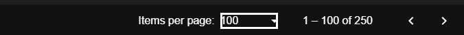
<br>

### Explore Page
In the explore page it displays a list of cryptocurrencies along with their market data. The crypto-currencies and their market data are fetched using the [Coingecko Api](https://docs.coingecko.com/v3.0.1/reference/introduction).
<br>
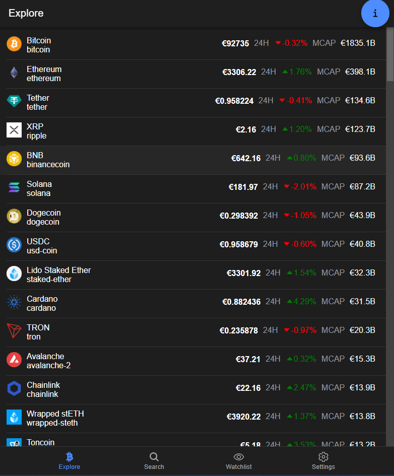
<br>
Swiping on a coin reveals options to add or remove a coin from your "watchlist".
<br>
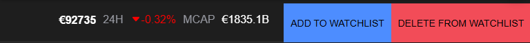
<br>
<br>
**Market Graph**
Upon selection of a coin the page redirects to the graph page, which will display the selected crypto currency's historical data of 24 hours.
and below it displays additional data about the coin.
<br>
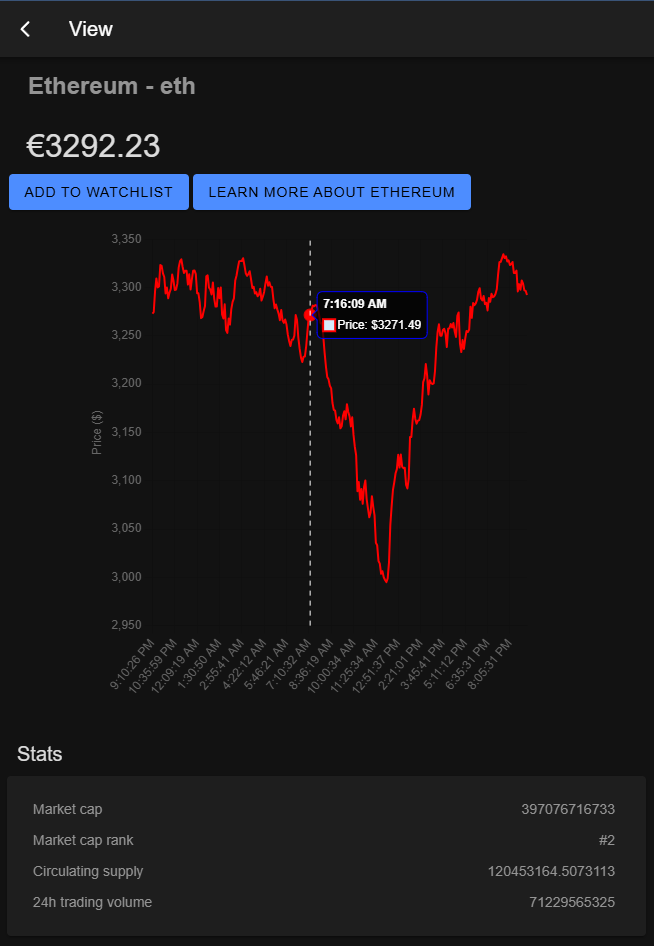
<br>
<br>
**Add to watchlist**
<br>
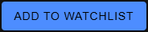
<br>
When selected the crypto currency currently being viewed will be added to your list of saved crypto-currency called
"watchlist".
<br>
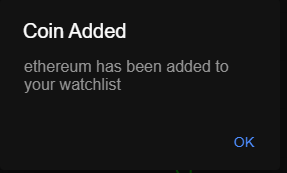
<br>
<br>
**Learn More about __**
<br>
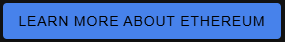
<br>
Pressing this button opens up a web browser which will redirect the user to the google explorerer giving additional information about the crypto currency. This functionality is powered by Ionic's Capacitor [Browser module](https://capacitorjs.com/docs/apis/browser) which will allow for the browser to be opened on all devices no matter the platform
<br>
<br>
<br>
### Search
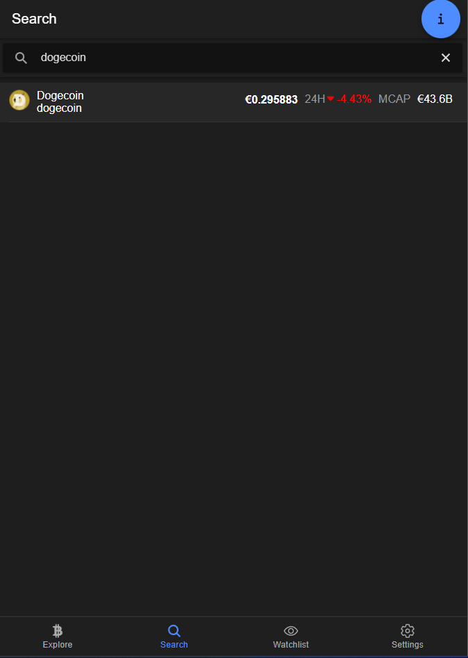
<br>
Pressing the search icon located on the nav bar will send you to a page with a search bar at the top of the screen. Select the searchbar then enter a valid crypto currency and press enter on your keyboard and a crypto currency matching your query will display. You can add the the coin to your watchlist by swiping or view it by tapping or clicking just like on the explore page.
<br>
### Watchlist
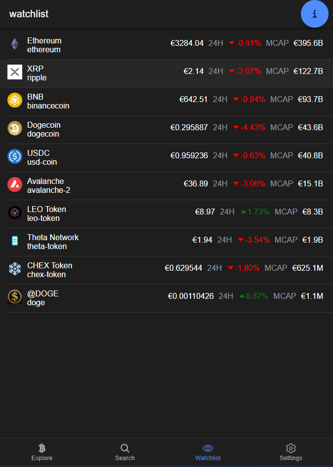
<br>
This page displays a list of your saved coins that are associated with your account saved on firebase. The functionalites are the same as it is on the explore page but when swiping a coin you are only given the option to delete from your watchlist.
<br>
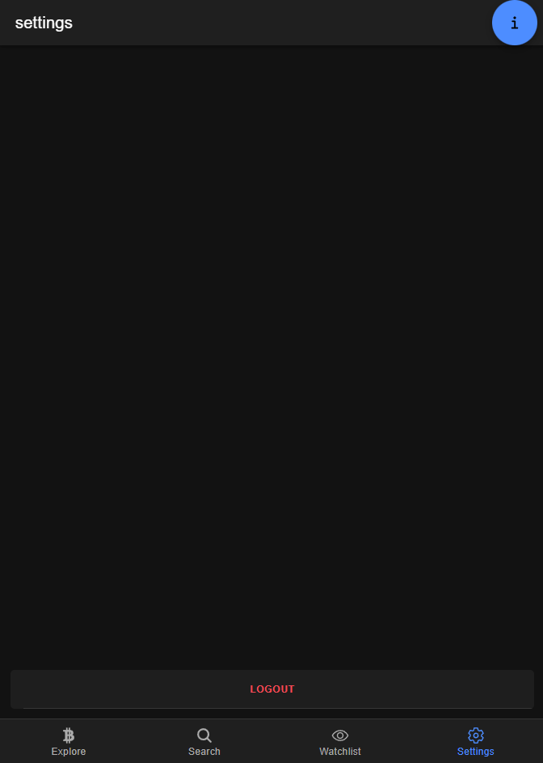
<br>
This page only displays a logout button at the bottom of the screen. Pressing it will redirect you back to the login page and disconnect your authentication to firebase.
<br>
### AI Assisstant
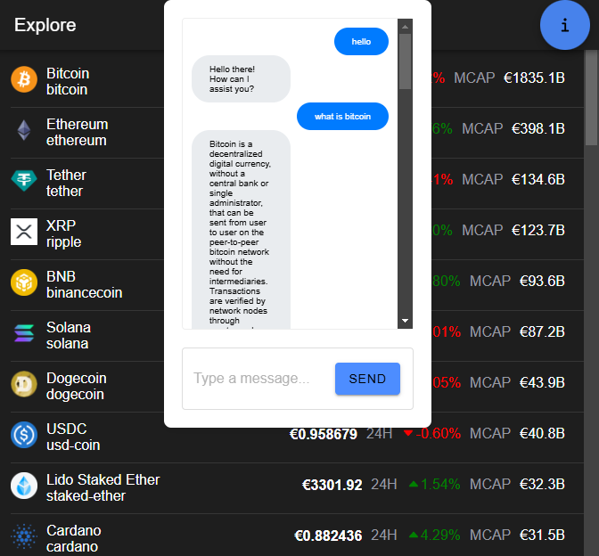
<br>
Selecting the "i" icon will display a chatbot that specialises in conversational abilities with a vast array of knowledge on different subjects including crypto-currencies. You can type in the input box then select "send" to forward the message to the chatbot and the bot will respond in seconds. This AI is powered by the [Gemini API](https://ai.google.dev/api/generate-content). To close the chatbox just press the i button again.

## Running the Application

- Install [Node.js](https://nodejs.org/en)

```MARKDOWN
    1. git clone <repository-url>
    2. cd <repository-directory>
    3. npm install -g @angular/cli
    4. npm install -g @ionic/cli
    5. npm install -g @capacitor/cli
    6. npm install -g firebase-tools
    7. npm install
    8. ionic serve
```

## Minimum Project Requirments

Confirm and demonstrate how you have met all minimum project requirments:


1. **Fully Contained Project**:
    <br>
    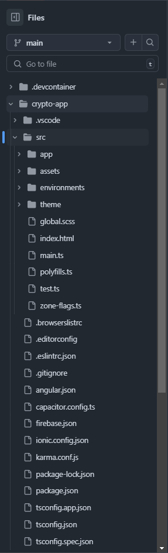
    <br>
- All the necessary files are included in the Github repository including the  ionic folder `crypto-app` as well as its config files and typescript files.         .

2. **Working Ionic Angular App**:
    <br>
    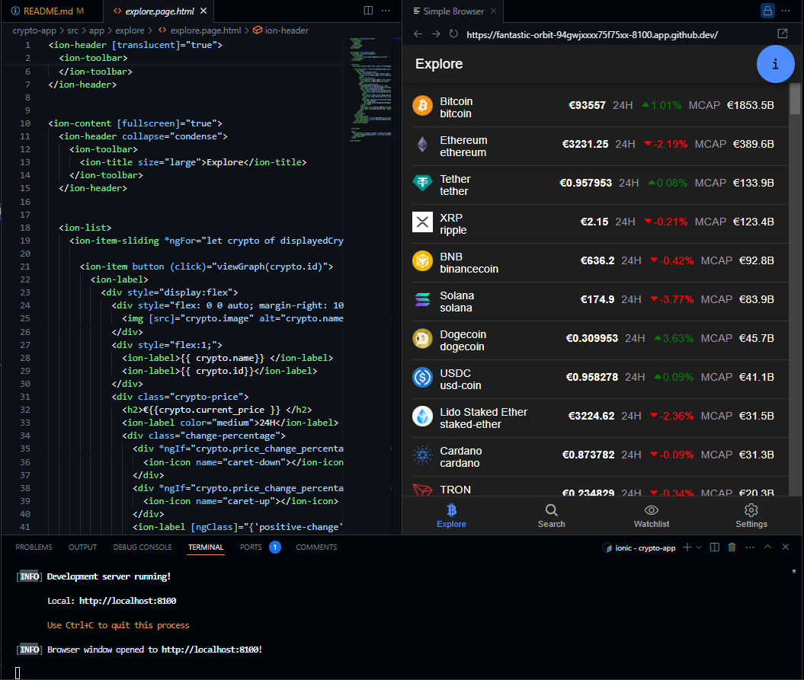
    <br>
- From the image above you can see that the application is working and running and as you can see from the list of crypto currencies it matches the topic I chose which was a crypto app.
    <br>
3. **Use of Angular Router**:
    <br>
    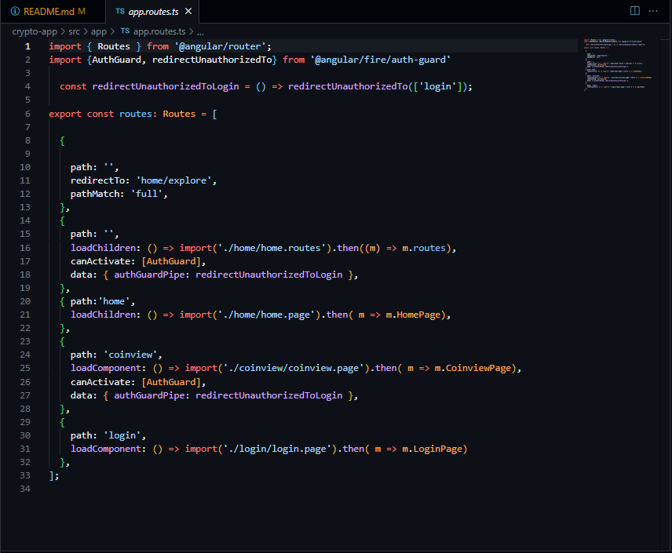
    <br>
    The typescript file above defines the global routes that will render a page to the user. It uses Ionic RouterModule to configure the routes and lazy load the componentes for each page. The routes include the paths for the home page as well as its children routes, the coinview page and the login page. The pages contain route guards which block users which arent signed in from accessing the page. These paths are then used when using Angular Router.
    <br>
    <br>
    **Import**
    <br>
    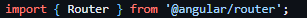
    <br>
    <br>
    **Inject**
    <br>
    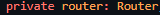
    <br>
    <br>
    **Implement**
    <br>
    
    <br>
4. **Connection to a Backend Service**:
    <br>
    The app uses firebase to handle authentication an store user information such as the user's saved coins.
    <br>
   **Configuration**
   <br>
   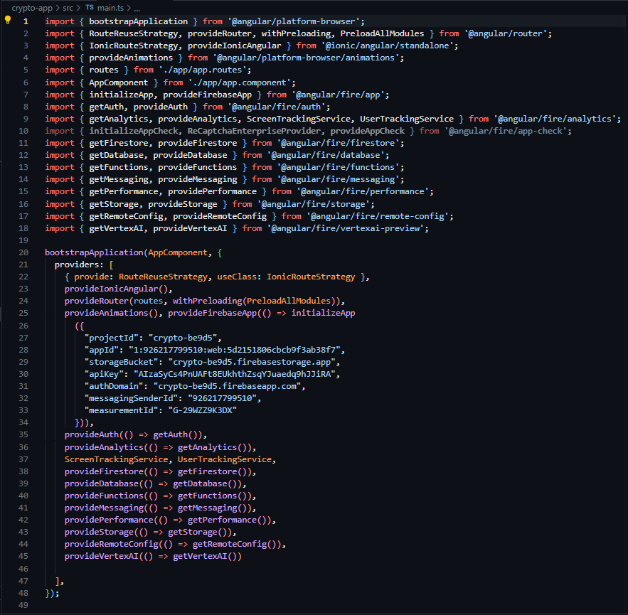
    - In `main.ts` it initialises the connection to the firebase account and project and sets up the firebase services that will be implemented in the angular app.
   <br>
    **Firebase Storage**
   <br>
    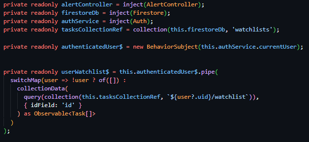
    - The service code stub above uses firestore services to fetch a document from the database and retrieve its data using an observable to receive up-to date data.
   <br>
     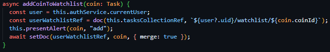
   <br>
    - The code snippet of the function highlights the implementation of firebase's storage services to store coinId's under the user's unique id in the firestore document.

5. **Use of a Capacitor Native Plugin**:
    - This app uses Ionic's Browser Capacitor to access the native functionality of opening a browser on a mobile device.
    <br>
    **Import**
    <br>
    - 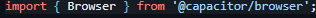
    <br>
    **Implementation**
    <br>
    - 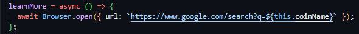
<br>

6. **Unique Project**:
  - This app shouldn't resemble any project that I have made as this is the first time I have ever used the coingecko API as well as creating a crypto applicatin.

7. **Code Compilation**:

- As displayed on the screenshot, the code compiles without any errors.

8. **Code commenting**
- 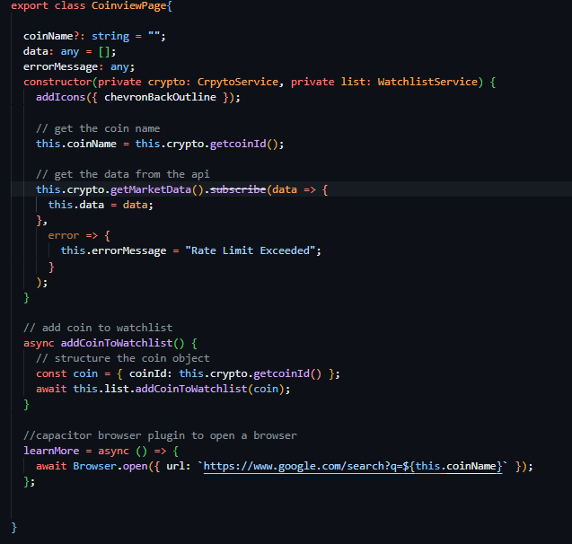
<br>

9. **Consistent code commits per week**
 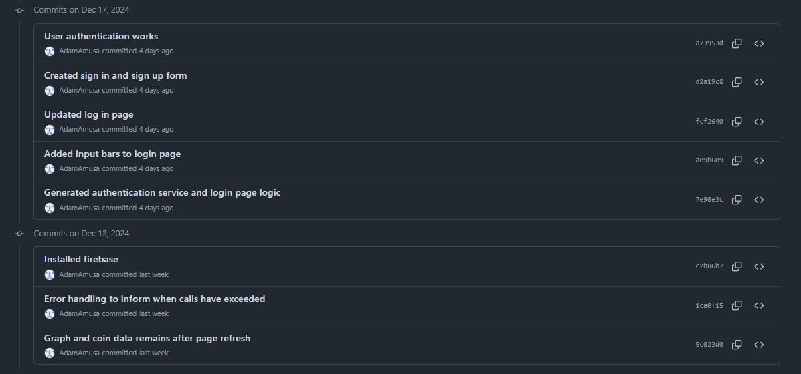


10. **Code formatted in a Consistent and Standard Way**
- **Encapsulation**: Services are encapsulated in seperated files to allow for convinient and easy use of them throughout the application.
- **Indentation**: I use Visual Studio's build in code formatter to indent my code in a readable format.
- **Naming Conventions**: Classes and services are named appropriately based on their functionality or page name, to allow for easy context gathering when reading over the code.
## Project Requirments above and beyond

Discuss any application features or design elements that show you went above and beyone basic requirments.

## Application Architecture

Discuss in detail how the application is structured. List all pages and their purpose. List their methods and what they do. Discuss what structures are used to store data object.

Add a screenshot of the application architecture.

## Roadblocks and Unfinished Functionality

Discuss the issues you faced with creating your application. Provide possible solutions to these issues. What would you have done differently if you had to do this again? What did you not get finished?

## Resources

Provide links to resources used:

* [YouTube](https://www.youtube.com/watch?v=Y0vH5Cm3HAk) - YouTube Tutorial I found helpful
