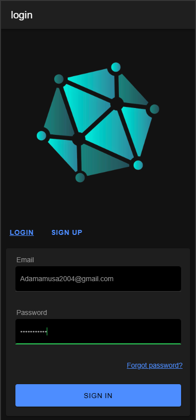

# Crypto Viewing Application

**Student Name:** Adam Amusa  
**Student ID:** G00400197  

## Application Function

### Authentication
Users must log in or sign up to access the full functionality of the application. User credentials are stored and validated through [Firebase](https://firebase.google.com/).



### Explore Page
The Explore page displays a list of cryptocurrencies along with their market data. The crypto-currencies and their market data are fetched using the [Coingecko API](https://docs.coingecko.com/v3.0.1/reference/introduction).


Swiping on a coin reveals options to add or remove a coin from your "watchlist".


#### Market Graph
Upon selecting a coin, the page redirects to the graph page, which displays the selected cryptocurrency's historical data of 24 hours and additional data about the coin below.


#### Add to Watchlist
When selected, the cryptocurrency currently being viewed will be added to your list of saved cryptocurrencies, called your "watchlist."


#### Learn More Feature


Pressing this button opens a web browser, which redirects the user to Google Explorer, which provides additional information about the cryptocurrency. This functionality is powered by Ionic's Capacitor [Browser module](https://capacitorjs.com/docs/apis/browser), which allows the browser to be opened on all devices regardless of platform.

### Search


Pressing the search icon on the nav bar will send you to a page with a search bar at the top of the screen. Select the search bar, enter a valid cryptocurrency, and press enter on your keyboard. A cryptocurrency matching your query will display. You can add the coin to your watchlist by swiping or view it by tapping or clicking, just like on the Explore page.

### Watchlist


This page displays a list of your saved coins that are associated with your account saved on Firebase. The functionalities are the same as on the explore page but when swiping a coin you are only given the option to delete it from your watchlist.


This page only displays a logout button at the bottom of the screen. Pressing it will redirect you back to the login page and disconnect your authentication to Firebase.

### AI Assistant


Selecting the "i" icon will display a chatbot that specialises in conversational abilities with a vast array of knowledge on different subjects including crypto-currencies. You can type in the input box then select "send" to forward the message to the chatbot and the bot will respond in seconds. This AI is powered by the [Gemini API](https://ai.google.dev/api/generate-content). To close the chatbox just press the i button again.

## Running the Application

Prerequisites:
- Install [Node.js](https://nodejs.org/en)

```bash
1. git clone <repository-url>
2. cd <repository-directory>
3. npm install -g @angular/cli
4. npm install -g @ionic/cli
5. npm install -g @capacitor/cli
6. npm install -g firebase-tools
7. npm install
8. ionic serve
```

## Minimum Project Requirements

### 1. Fully Contained Project


All necessary files are included in the GitHub repository including the ionic folder `crypto-app` as well as its config files and typescript files.

### 2. Working Ionic Angular App


From the image above you can see that the application is working and running and as you can see from the list of cryptocurrencies it aligns with the topic, I chose which was a crypto app.

### 3. Use of Angular Router


The typescript file above defines the global routes that will render a page to the user. It uses Ionic RouterModule to configure the routes and lazy load the components for each page. The routes include the paths for the home page as well as its children's routes, the coin view page, and the login page. The pages contain route guards which block users who aren't signed in from accessing the page. These paths are then used when using Angular Router.

**Import:**
<br>


**Inject:**
<br>


**Implementation:**
<br>


### 4. Connection to Backend Service
The app uses Firebase to handle authentication and store user information such as the user's saved coins.

**Configuration:**
<br>


- In `main.ts` it initializes the connection to the firebase account and project and sets up the Firebase services that will be implemented in the angular app.

**Firebase Storage:**
<br>


 - The service code stub above uses Firestore services to fetch a document from the database and retrieve its data using an observable to receive up-to-date data.


  - The code snippet of the function highlights the implementation of Firebase's storage services to store coinId's under the user's unique ID in the Firestore document.

### 5. Use of Capacitor Native Plugin
This app uses Ionic's Browser Capacitor to access the native functionality of opening a browser on a mobile device.

**Import:**
<br>


**Implementation:**
<br>


### 6. Unique Project
  - This app shouldn't resemble any project that I have made as this is the first time I have ever used the Coingecko API as well as create a crypto application.

### 7. Code Compilation


The code compiles without any errors.

### 8. Code Commenting


### 9. Consistent Code Commits


### 10. Code Formatting Standards
- **Encapsulation**: Services are encapsulated in separate files to allow for convenient and easy use of them throughout the application.
- **Indentation**: I use Visual Studio's built-in code formatter to indent my code in a readable format.
- **Naming Conventions**: Classes and services are named appropriately based on their functionality or page name, to allow for easy context gathering when reading over the code.

## Project Requirements above and beyond
### Crypto Graph
- In `crypto-graph.component.ts` I implemented [ChartJs's ](https://www.chartjs.org/) charting library to build a line graph representing historical data of a coin over the last 24 hours. The chart data is fetched from CoinGecko's API and mapped into the data properties.  I also implemented a custom plugin that displays a vertical dash line when a mouse or a finger is dragged along the canvas. That custum plugin solution was supplied by an answer from [Stack Overflow](https://stackoverflow.com/questions/56793332/add-horizontal-crosshairs-using-chart-js). 

      this.chartInstance = new Chart(this.cryptoChart?.nativeElement, {
        type: 'line',
        data: {
          labels: data.prices.map((price: any) => new Date(price[0]).toLocaleTimeString()),
          datasets: [
            {
              hoverBorderJoinStyle: 'round',
              borderJoinStyle: 'round',
              label: 'Price',
              data: data.prices.map((price: any) => price[1]),
              borderColor: this.lineColor,
              backgroundColor: 'rgba(54, 162, 235, 0.2)',
              fill: false,
              pointRadius: 0,
              pointHoverRadius: 6,
              pointHoverBackgroundColor: this.lineColor,
              borderWidth: 2,

            }
          ]
        },
        options: {
          responsive: true,
          maintainAspectRatio: false,
          interaction: {
            mode: 'index',
            intersect: false
          },
          layout: {
            
            padding: {
              left: 10,
              right: 10,
            }
          },
          plugins: {
            legend: {
              display: false,
            },
            tooltip: {
              enabled: true,
              position: 'nearest',
              backgroundColor: 'rgba(0,0,0,0.7)',
              titleColor: 'white',
              bodyColor: 'white',
              borderColor: 'blue',
              borderWidth: 1,
              callbacks: {
                title: (context) => {
                  return context[0].label; // Show the timestamp
                },
                label: (context) => {
                  return `Price: $${context.parsed.y.toFixed(2)}`;
                }
              }
            }
          },
          scales: {
            x: {
              title: {
                display: false,
                text: 'Time'
              },
              grid: {
                display: true,
                drawOnChartArea: true,
                drawTicks: true
              },
              
            },
            y: {
              title: {
                display: true,
                text: 'Price ($)'
              },
              beginAtZero: false,
              grid: {
                display: true,
                drawOnChartArea: true,
                drawTicks: true
              }
            }
          }
        },
        //Dashed line custom plugin
        plugins: [{
          id: 'customCrosshair',
          afterDraw: (chart) => {
            const ctx = chart.ctx;
            const chartArea = chart.chartArea;
            const scales = chart.scales;

            // Get the active elements (hovered elements)
            const activeElements = chart.getActiveElements();

            if (activeElements.length > 0) {
              const dataIndex = activeElements[0].index;
              const xScale = scales['x'];

              // Draw vertical line
              ctx.save();
              ctx.beginPath();
              ctx.moveTo(xScale.getPixelForValue(dataIndex), chartArea.bottom);
              ctx.lineTo(xScale.getPixelForValue(dataIndex), chartArea.top);
              ctx.strokeStyle = 'white';
              ctx.lineWidth = 1;
              ctx.setLineDash([5, 5]); // Dashed line
              ctx.stroke();
              ctx.restore();
            }
          }
        }]
      });
    

### Visual Demonstration
## 

### Segmented page in the coin Explorer
- In the `explore.html` page the user is given a list of 500 crypto-coins which were fetched from [CoinGecko's API](https://www.coingecko.com), Rendering an ionic list of 500 contents takes a good while, and scrolling through 500 crypto-coins can be mundane, Thus I implemented [Angular Paginator](https://material.angular.io/components/paginator/overview) to segment the response of 500 coins into 100 each to reduce load time and improve the design of the page. 

`<mat-paginator [length]="100"
              [pageSize]="10"
              [pageSizeOptions]="[5, 10, 25, 100]"
              aria-label="Select page">
</mat-paginator>`
- This is done by defining your preferred page size which would be the amount of data that will be rendered per page, and the length which is the total amount of data that will be partitioned.
### Visual Example


### Code Demonstration
```typescript
export class ExplorePage {

  cryptos: any[] = [];
  displayedCryptos: any[] = [];
  pageSize = 100;
  length = 0;
  pageIndex = 0;

  constructor(private crypto: CryptoService, private router: Router, private watchlist: WatchlistService) { }

  async ngOnInit() {
    this.crypto.getCoinList().subscribe(data => {
      this.cryptos = data;
      this.length = data.length;
      this.updateDisplayedCryptos();
    });
  }

  updateDisplayedCryptos() {
    const startIndex = this.pageIndex * this.pageSize;
    const endIndex = startIndex + this.pageSize;
    this.displayedCryptos = this.cryptos.slice(startIndex, endIndex);
  }

  onPageChange(event: PageEvent) {
    this.pageIndex = event.pageIndex;
    this.pageSize = event.pageSize;
    this.updateDisplayedCryptos();
  }

}
```

## Application Architecture


### Login Page
The user enters their credentials into the input sections of the page and is validated using form control to see if the value entered is of the right format. The user presses login or signup and is authenticated using Firebase's `createUserWithEmailAndPassword()` for when the user wants to sign up and the `signInWithEmailAndPassword()` for when the user would like to log in. The functions return an authentication status as a promise which will allow the users to access the main functionalities of the app and redirect them to the home page.

### Explore Page
Crypto data is fetched and rendered onto the explore page using a function from `crypto.service.ts`.
- Users can add coins to their watchlist or delete coins from their watchlist. The user presses "save to watchlist" and the user's Firebase document data in the watchlist collection gets updated with the coin ID, and when a coin is deleted the coin that matches the document query is deleted. This functionality is injected from `watchlist.service.ts`.
### Search Page
The user enters a coin name into the search bar, they press enter on the keyboard and only one coin is requested from the API, this functionality is implemented from `crypto.service.ts`'s `getMarketData()` function which fetches data based on the coin id. 

### Coinview Page
The user selects a coin from the list of coins and the id is then used to fetch additional coin data to display to the user, this id is then used to render historical coin data into the `crypto-graph.component.ts` which will render a line graph into the coin view page.

### Watchlist Page
Displays a list of coins that is saved into the user's document in the watchlist collection, the user also can delete coins from their watchlist on this page. The user's data is fetched using the `watchlist.service.ts` function `getCoinList()` which fetches up-to-date data from the Firebase collection and crypto API using an Observable return type.

### Settings Page 
This page only contains a singular button that can be pressed by the user to logout, the button calls the Firebases `signOut()` function which logs out the currently logged-in user and terminates any authentication tokens that were stored.

## Roadblocks and Unfinished Functionality
- **Coin Validator**: I wanted to implement a function that would take in coin IDs from all of the coins from the explore page and validate if the coin is in the user's watchlist but unfortunately, I encountered a problem where the page would freeze when the function is being called. I suspected the issue might have been due to the usage of the pipe() function or Observable type to constantly listen for updates in the user's document. Perhaps I should have changed the function from a type observable to just any type. 

## Resources
* API: [Coin Gecko ](https://www.coingecko.com/)
* AI Component: [Google AI Studio](https://ai.google.dev/gemini-api/docs)
* Framework: [Ionic Framework](https://ionicframework.com/)
* Crypto Chart: [ChartJs ](https://www.chartjs.org/)
* Explore Page: [Angular Paginator](https://material.angular.io/components/paginator/overview)


